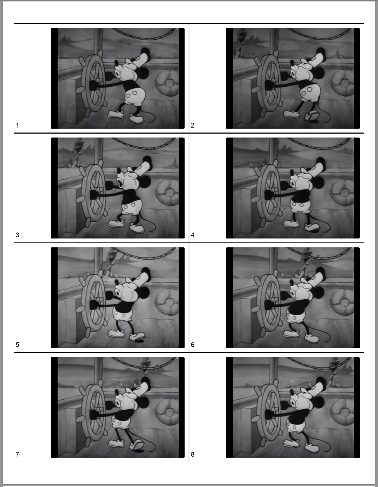

# flipbook

Create a flipbook from a video file by extracting frames and creating tiled output layouts on a specified paper type.

The output pages can be printed and cut manually to be assembled into a flipbook.

# Setup
To install the dependencies for the script, run:

```pip install -r requirements.txt```

# Script Arguments

The script requires the following positional arguments:
* The video file to use as the source for the flipbook
* The directory in which to write the output files
* [Optional] A base name for the output files

Also there are the following options:
Frame extraction settings:
* -fr (--output-frame-rate): The frame rate at which the video frames will be extracted
* -W (--width): The width of the resulting flipbook
* -H (--height): The height of the resulting flipbook

Paper settings:
* -p (--paper-type): The paper type on which to print the flipbook frames (currently US Letter ad US Legal are options)
* -d (--dpi): The dots per inch being printed

Flipbook frame formatting settings:
* -bp (--border-padding): Padding to be applied equally to all sides of frame image
* -lp (--left-padding): Additional padding to be applied to the left side of the frame (for binding)
* -lw (--border-line-width): width of the line for the border drawn around each frame

# Running the script

Examples:

```
python create_flipbook.py input_videos/steamboat_willie_mickey.mov flipbook_output/mickey --output-frame-rate 5 --width 4 --height 2.5 --border-padding 30 --left-padding 180 --border-line-width 3
```
Output is the following:

```commandline
----------------------------
Input Video Info
----------------------------
Input file: input_videos/steamboat_willie_mickey.mov
Resolution: 1726.0x1298.0
Frame rate: 59.34 fps

----------------------------
Output Flipbook Format
----------------------------
Flipbook frame size: 1200x750
border_padding: 30
left_padding: 180
border_line_width: 3


Extracting frames from input_videos/steamboat_willie_mickey.mov at 5.0 FPS
 98%|█████████████████████████████████████████████████████████████████████████▊ | 441/448 [00:02<00:00, 172.71it/s]
   ...Stopping extraction at frame 441.
   ...Done extracting frames.


Saving printable flipbook to flipbook_output/mickey with paper type letter at 300 DPI.
----------------------------
Printable Flipbook Specs
----------------------------
Printed page type: US Letter
Printed page orientation: PORTRAIT
Printed page size (inches): 8.5x11.0
Printed page size (pixels): 2550x3300
Printed page dpi: 300
Frames per page: 4x2
Pages to print: 5
Output file: flipbook_output/mickey/steamboat_willie_mickey.pdf
----------------------------


Saving printable flipbook: 100%|█████████████████████████████████████████████████████| 5/5 [00:02<00:00,  1.88it/s]


Wrote flipbook_output/mickey/steamboat_willie_mickey.pdf

```


This results in a PDF with 9 pages of tiled frames, each having a watermark with the frame number.

Each page looks something like:


The output PDF containing all tiled frames can then be printed, cut, assembled and bound into a flipbook.
